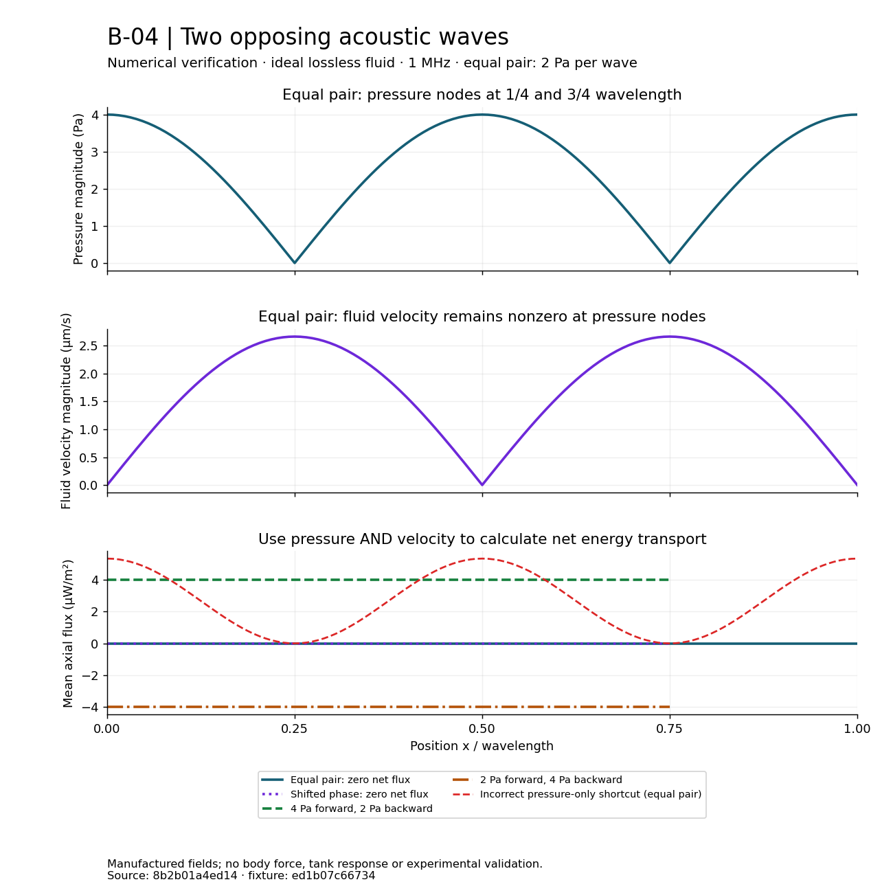

# B-04 — Counterpropagating-Wave Numerical Verification

**Date:** 2026-10-02 · **Comparison:** PASS in the declared kernel domain · **Physical validation:** INDETERMINATE

Protocol: [ANA-REF-1.0](B03-B06-analytical-protocols.md), [COUNTERPROPAGATING-1.0](../research/counterpropagating-kernel.md). Source: [`8b2b01a4ed14b9ca861bfedac3ececb65a93b3c7`](https://github.com/Andioratech/AURA/commit/8b2b01a4ed14b9ca861bfedac3ececb65a93b3c7). This report records software verification of an ideal analytical field. It is not a physical recorder run, experimental observation, force result or completed P3 campaign.

## Domain and executed matrix

Two prescribed opposite incident plane waves in an infinite homogeneous, stationary, linear, inviscid, lossless fluid. Manufactured rho=1000 kg/m³, c=1500 m/s, f=1 MHz, wavelength=0.0015 m; each peak amplitude is explicitly 0, 2 or 4 Pa. Observation box [-0.0015,0.0015] m on each axis; reference points at zero in the main matrix. Time dependence follows exp(-i omega t), with net energy flux averaged over one period. No tank, transducer, loss, body response, force, trajectory or gravity is represented.

The [frozen fixture](../../tests/fixtures/fields/B04-counterpropagating.json) contains eight configurations and **157 observations**: equal pair (129 points over one wavelength), phase-shifted pair, unequal amplitudes, reversed imbalance, common phase, oblique direction, zero drive and a single-source limit (four points each). Further unit checks cover translation, rotation, source order, resource limits and intentional invalid inputs. No parameter search or tolerance change occurred.

The [independent reference](../../tests/counterpropagating_reference.py) evaluates combined sine/cosine identities through Decimal scalar pairs; production instead sums separate complex source fields. The oracle imports no production field/unit functions or binary trigonometry. It shares only independently implemented test series/constant primitives with B-03. The 60/80-digit results agree to the required 45 normalized decimal places. Separate literal pressure/velocity/gradient/flux tables check both the oracle and production at standing-wave quarter turns, the phase-shifted origin and both imbalance directions.

The published-source rerun passed **60 B-04 tests in 0.71 s**. Full local Quality passed **1,223 tests in 16.01 s**; [exact GitHub Quality](https://github.com/Andioratech/AURA/actions/runs/37044324608) passed **1,223 tests in 21.68 s**, including installation, environment checks, lint and required documents. Existing B-03 tests remain in the complete suite.

## Actual numerical errors

Each complex component uses abs(actual-reference)/S; flux uses a real difference. Scales are C, C/Z, k*C and C²/(2Z), with C the total source amplitude (2 Pa fallback for zero drive). This matrix uses C=2, 4 or 6 Pa. The maximum threshold remains **4.547473508864641e-13** (2048e), frozen before execution. RMS values below pool all observations/components, not case averages.

| Observable | Components compared | Maximum normalized error | Pooled RMS normalized error |
|---|---:|---:|---:|
| Pressure | 157 | 9.020562075e-16 | 1.882129190e-16 |
| Velocity | 471 | 7.940933881e-16 | 9.918714011e-17 |
| Pressure Gradient | 471 | 7.599405319e-16 | 9.770879051e-17 |
| Intensity | 471 | 7.058607894e-17 | 9.379430117e-18 |

Values are rounded for display; JUnit retains every error and scale. Maximum actual-argument sine/cosine absolute error was **5.4912682234313612e-17**, below the separate 4e=8.881784197001252e-16 assumption. These are observations on the tested backend and bounded arguments, not universal precision guarantees or experimental accuracy.

The equal pair retains nonzero velocity at pressure nodes and has zero period-mean flux. A relative phase shift preserves zero net flux for equal amplitudes. The 4 Pa / 2 Pa pair yields +4e-6 W/m² axial flux; reversing that imbalance yields -4e-6 W/m². Common phase, geometry transformations, source order, the single-source limit, Euler consistency and serialized node values pass their declared checks.

Known-wrong velocity sign, averaged source pressure and missing gradient exceed the unchanged error budget. At the standing pressure antinode the intentionally wrong pressure-only shortcut predicts 5.333333e-6 W/m² while the correct net flux is zero. This numerical counterexample excludes that shortcut for this field; it establishes no acoustic-force bound. Unsupported medium/frequency/direction, malformed geometry, inadequate memory allowance and out-of-range phases are rejected before either source is evaluated. Combined overflow is a typed failure. No AURA feasibility inference follows.

## Diagnostic figure

The first two panels display magnitudes of the equal pair's complex pressure and axial fluid velocity, not simultaneous real-time snapshots. The last panel uses computed mean flux, including phase-shifted and unequal cases. The red dashed curve is an explicitly incorrect pressure-only calculation, included to expose the error. Lines connect the frozen samples: 129 for the equal pair and four for the phase/imbalance variants. Values beyond those four-point traces are not additional tested samples.

The reviewed PNG is 174,330 bytes, within ANA-03's explicit <=500 KiB publication exception. The exporter runs in ENV-1.0; Matplotlib 3.10.8 runs in a separate optional environment, with [pinned hashed renderer wheels](../../requirements/render-b04-linux-py312.lock). Reproduction commands are in [requirements guidance](../../requirements/README.md#optional-b-04-figure-renderer). Rendering reads field data and supplies no mathematical reference. The render lock was installed with forced hash checking, pip check passed, and the final PNG was visually inspected. Figure/JSON overwrites are refused; the exporter test verifies field contents and that rejected overwrite leaves bytes unchanged.

## Resource observations and retained attempts

The 256-sample pair evaluation plus encoding used **510491 bytes** peak traced Python allocation against **1,056,768 bytes** admitted workspace; encoded components occupied **42748 bytes** against 294,912. Observed elapsed time was **0.196953 s** under tracing. Whole test-process peak RSS was **35631104 bytes** including interpreter/imports. These measurements do not replace future recorder/PDE resource admission. No GPU or randomness was used.

The first development comparison passed 189 combined B-03/B-04 tests. An initial lint-only check caught C408; a later full workflow stopped at I001/PLW1510 in the added export test. Those style/subprocess-contract issues were corrected before publication; the failed full-workflow log is retained. The initial plot had overlapping legend/footer, corrected by spacing. Both development plots and their data remain in the report. No executed functional test failed and no numerical threshold was relaxed. The complete development record is in [ANA-03](../work-items/ANA-03.md).

## Reproducible software report identity

Verification ID: `VERIFY-ANA03-85f7169fa9d84e9397e56d69d9e28e38`.

Local retention path: `results/verification/ANA-03/VERIFY-ANA03-85f7169fa9d84e9397e56d69d9e28e38/`, retained in the executing checkout and mirrored to the shared workspace. It includes source/environment observations, all three ENV-1.0 locks, fixture/protocol/oracle/test copies, JUnit and logs, plot input/output, renderer lock/package inventory/install evidence and development attempts. Before/after source and environment observations agreed. The exported published data explicitly records clean source. Every indexed checksum was independently rechecked.

| Artifact | SHA-256 |
|---|---|
| `verification.json` | `e759f396ffbffca0883a55b9e06fc1b3303323090f6035ec5adb240cc048b124` |
| `benchmark.xml` | `d34a6d28274550e31cda0c81a377b4c63c2a0f3919d946ddb6d1b65881a879c3` |
| `B04-counterpropagating.json` | `ed1b07c66734ea4e53447af1e2e5a4a0f01b45dcd701c23e3013b545f323d6a7` |
| `plot-data.json` | `078aa625b9ac8d59405769c2240c20bbc61b244b39d5293b717fc0752a89b075` |
| `B04-standing-wave.png` | `c23834a5157d659ffa44a0db315c91da2c2003037ba7d8a3c8e9f100fb5e260a` |
| `render-b04-linux-py312.lock` | `5443387adb9bd656121b2059b95e7859a838ab5cf8e9cf95238e49930d8f0ad7` |

The separately retained `verification.sha256` authenticates the report index. Generated raw evidence stays outside Git. On the exact source and locked development environment run `pytest tests/test_counterpropagating.py -o junit_family=xunit1 --junitxml=<unused-path>`. Observed timing/RSS/timestamps may differ on reproduction; frozen comparisons must pass. For an identical figure identity, export from the recorded source revision before rendering with the pinned optional environment.

This report is software verification, not a D07 RunManifest. There is no physical-model acceptance, independent external review or experimental-validation verdict. [The artifact review](../reviews/ANA-03-counterpropagating.md) closes ANA-03 and opens ANA-04. P3 remains open for noncollinear fields, spreading, balances, FIELD-1.0 physical recorder admission and the complete recorded campaign. Real water measurements, particles, larger objects/masses and microgravity retain their own model and evidence gates.
