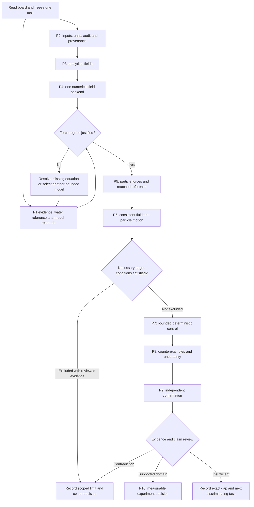

# 05 — Evidence-Based Decision Tree

## Main path

Arrows denote work dependencies, not automatic scientific PASS. An exploratory artifact may exist while a comparison is INDETERMINATE. Advancement that would bypass a mandatory baseline gate requires a recorded decision, not a favorable plot.

## Decision cards

| ID | Trigger and evidence | Default next action | Alternative and required record | Re-entry condition |
|---|---|---|---|---|
| D-01 | No complete water measurement found after two research cycles | Continue P2/P3 verification and label benchmark gap | Select another measured observable/reference in LIT-02; owner decides changed target/material scope | Source parameter/uncertainty map complete or explicit exploratory protocol |
| D-02 | ka and other applicability checks support selected particle model | Implement that model only | If viscosity/thermal/wall effects exceed the error budget, FOR-06 selects the necessary refinement | Source equations and overlap reference available |
| D-03 | Particle model is outside a hard domain | Reject that run for evidence | Narrow the research domain through a new experiment, or research scattering model; do not reuse the water particle model for the air sphere | New model passes its own verification and benchmark gate |
| D-04 | Fast field backend cannot represent required walls/scattering | Document missing physics and its effect | Select one necessary FEM/BEM/other backend after D05 preflight; keep old results labeled | Matched boundary/reference case and resource budget approved |
| D-05 | Radiation-only motion differs when flow is included | Include a justified streaming/drag representation | If unavailable, limit the claim to a simplified model and mark physical validation INDETERMINATE | Fluid-model evidence and force ledger complete |
| D-06 | Inertial time scale is below observation resolution | Register a suitable finite-window observable and qualified reduced model | If transient acceleration is essential, implement justified inertial/unsteady dynamics and adequate observation | MOT-01 time-scale review and target contract agree |
| D-07 | Necessary bound excludes the target | Preserve a scoped exclusion certificate; skip expensive control tuning for that case | Owner may choose a smaller target/duration or new geometry in a new experiment | New target/domain passes necessary-condition screen |
| D-08 | Optimizer/controller fails but no exclusion is established | Diagnose scaling, initialization, constraints and reachability | Try a predeclared second deterministic method within the trial budget; never label search failure impossible | Known feasible toy and realized-action checks pass |
| D-09 | Good behavior disappears under refinement | Classify original run as numerically unsupported | Fix numerics or refine subproblem; preserve original | Required physical observable converges |
| D-10 | Success exists only at unsupported pressure/power/temperature | Report hypothetical model result with failed physical constraint | Change constraints only through sourced evidence or a new hypothetical study | Limits verified and all actuators/thermal assumptions recorded |
| D-11 | Missing measured uncertainty or independent review | Keep affected validation/claim INDETERMINATE/UNDER-REVIEW | Assemble reproducible evidence and advance independent eligible tasks | Missing evidence or named review supplied |
| D-12 | Evidence supports transport/trapping but acceleration fails | Report H-ACCEL outcome as observed | Owner may register a transport/trapping project objective; never relabel the failed acceleration target | New hypothesis and observable approved before new evaluation |
| D-13 | Ideal zero-gravity case works; residual case fails | Map sensitivity and record the conditional ideal result | Reduce target/domain or improve observation/actuation only in a versioned experiment | Residual-environment assumptions and robustness checks pass |
| D-14 | Single-particle case works | Close only that domain | Multi-particle/material/shape expansion needs interaction/observability research and independent evidence | Scope decision plus updated model and validation plan |
| D-15 | Independent methods disagree | Freeze the claim and align inputs/definitions first | Review shared omissions, independent derivations and reference calibration | Difference resolved or claim remains LIMITED/INDETERMINATE |
| D-16 | Investigate greater mass, larger dimensions or another body shape under DEC-004 | Start SC-01/SC-02 source and model-applicability research; retain initial foundation work | SC-03/SC-04 execute the selected new case only after their model-specific gates; do not require a favorable particle result to research another regime | New domain, equations, independent reference and resource protocol support the applicable phase review |

## Owner decisions versus implementation decisions

Owner decision records are needed for changing the scientific objective, body/material domain after freeze, acceptance criteria, spending/hardware, external communication, or publication claims. Provide a concrete evidence-backed choice with consequences using the [decision template](templates/decision-record.md).

Implementation details already within a reviewed task—module naming, error handling, dependency fixes, diagnostic plots, local benchmarks and source reading—do not require another permission request. Record the rationale and proceed.

## Resuming after a branch

Record original task ID, triggering evidence, branch ID, affected experiment/claim, invalidated assumptions, preserved artifacts, new task and explicit re-entry gate. Update the board in the same change. A retry keeps the scientific configuration fixed; a changed assumption creates a new experiment/configuration revision. Review evidence from both branches before closing a claim.
