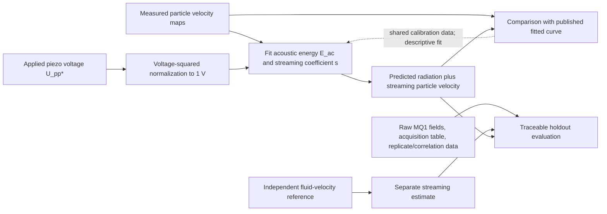

# Fluid Motion, Walls, Thermal Effects and Omitted Terms

**Prepared:** 2026-10-03 · **Work item:** LIT-04 · **Status:** bounded effect ledger complete; coupled model and formal measurement acceptance remain open

## Scope and primary evidence

This ledger applies only to the exploratory SRC-W03 MQ1 case: measured polystyrene spheres in Milli-Q water at 25 °C, a 1.940 MHz transverse standing half-wave in a 35 mm × 377 µm × 157 µm channel, and micro-PIV particle velocities in the ultrasound symmetry plane. It separates the article's particle-velocity observable from radiation force. It does not describe a free body in unbounded water, a human/macro-scale object, an AURA actuator, or microgravity performance.

Primary records: [Barnkob et al. (2012), DOI 10.1103/PhysRevE.86.056307](https://doi.org/10.1103/PhysRevE.86.056307), especially Eqs. (11)–(18), (21)–(22), Table I, Sections III–V; [author manuscript](https://arxiv.org/html/1208.6534). For comparison, [Muller et al. (2013), DOI 10.1103/PhysRevE.88.023006](https://doi.org/10.1103/PhysRevE.88.023006), especially its 3D particle-motion and uncertainty maps; [author manuscript](https://arxiv.org/html/1303.0201). Brownian diffusion scaling is derived from Einstein's original treatment of suspended-particle diffusion ([1905 source record](https://echo-old.mpiwg-berlin.mpg.de/ECHOdocuViewSB?mode=texttool&pn=10&url=%2Fpermanent%2Feinstein%2Fannalen%2FEinst_Ueber_de_1905%2Findex.meta&viewMode=xml)) together with the Stokes drag convention used in SRC-W03 Eq. (11).

## Force and observable ledger

| Term / process | Source-backed representation or scale | MQ1 status and implication |
|---|---|---|
| Acoustic radiation force | SRC-W03 Eq. (2) for a 1D transverse standing resonance: `F_rad = 4π a³ k E_ac Φ(κ~,ρ~,δ~) sin(2ky)`; viscous contrast factor depends on particle/fluid properties and `δs/a`. | It is a force on a sphere under small-particle conditions, not the directly measured output. The paper's energy/contrast/fitted response must not be treated as a separate directly calibrated force observation. LIT-03 retains a thermoviscous formulation as provisional candidate. |
| External acoustic streaming and its particle drag | SRC-W03 Eq. (11): `u_p = F_rad/(6π η a) + U` in its ideal terminal-drift representation; Eq. (12) sums radiation-induced and streaming-induced velocity amplitudes. Its actual regression adds wall correction in Eq. (15). | Directly relevant. The source reports a boundary-driven vortical flow; its rectangular and thermoviscous corrections modify a parallel-plate isothermal estimate. Without an independent fluid velocity map, particle velocity cannot distinguish `U` from radiation response. |
| Viscous drag and channel-wall correction | Stokes drag `6π η a` in the isolated unbounded baseline; SRC-W03 Eqs. (15)–(18) and Table I use a geometry/location-dependent multiplicative correction `χ`. | Reported example factors span approximately 1.004–1.092 across listed particle sizes and positions. At 10.2 µm diameter, the symmetry-plane parallel-motion factor is about 1.070 and at `z=±h/4` about 1.092. The value depends on local position and direction; it is not a universal channel factor. |
| Water thermoviscous response | SRC-W03 Eqs. (9)–(10) estimate temperature-dependent streaming enhancement and combine it with a rectangular-geometry reduction. | For the article's approximation, geometry and thermal factors partly offset, giving `s_r^T ≈ 0.194` versus parallel-plate isothermal `s_p^0=3/16≈0.188`. These are model-derived coefficients, not an independently measured flow field. Karlsen–Bruus additionally shows thermal boundary layers can affect particle scattering; matched material thermal properties remain open. |
| Gravity and buoyancy | For an isolated sphere at low Reynolds number, conditional Stokes terminal drift is `u_g = 2(ρp−ρ0)g a²/(9η)`; buoyant force is `(ρp−ρ0)(4πa³/3)g`. | Using source densities 1050 and 997 kg m⁻³, `η=0.890 mPa s`, and nominal Earth `g=9.80665 m s⁻²`, the unbounded-water settling screen is ≈0.011–3.35 µm/s across the six measured size means. This is a derived Earth-gravity screen, not an observed MQ1 drift or a microgravity value. Wall effects and exact orientation/time window are not included. |
| Brownian diffusion | Einstein relation with Stokes mobility: `D = k_B T/(6π η a)`; one-coordinate RMS diffusion over interval `t` is `sqrt(2Dt)`. | At 25 °C and source viscosity, calculated `D` ranges ≈0.832 µm²/s (0.59 µm diameter) to ≈0.0483 µm²/s (10.16 µm). For the smallest bead, 1D RMS displacement is ≈0.041 µm over 1 ms and `sqrt(2D t)` over an actual frame interval `t` remains the appropriate expression. Frame intervals, raw trajectory data and covariance are unavailable; no comparison with the measured drift or acceptance threshold is frozen. |
| Particle inertia / unsteady fluid response | SRC-W03 uses an algebraic, cycle-averaged terminal drift in Eq. (11), arguing that the characteristic particle-inertia scale `τc = ρp a²/η` is much shorter than the observed particle-motion timescale; SRC-W02 separately treats periodic-force momentum balance and particle oscillation amplitude. | Recomputing `τc` from SRC-W03's largest measured diameter `2a=10.16 µm` (Table III), `ρp=1050 kg m⁻³`, and `η=0.890 mPa s` gives 30.45 µs at the listed mean radius `a=5.08 µm`, not `<1 µs` as stated in Sec. II. The reported `±0.20 µm` diameter spread is retained without assigning it a confidence meaning; using its upper endpoint gives `τc=31.66 µs`. At the smallest listed mean radius `0.295 µm`, `τc≈0.103 µs`. This is a real arithmetic/scale discrepancy. It does not alone refute Eq. (11): that equation is for cycle-averaged particle drift, and comparison of `τc` with the 0.515 µs carrier period is not by itself a test of the mean-drift approximation. Under a separate isolated-sphere Newton-plus-Stokes model, `τrelax=m/(6πηa)=2ρp a²/(9η)=(2/9)τc`, giving 6.77 µs at the listed mean radius, or 0.68% of a 1 ms motion interval. This supports only a conditional timescale separation for that simplified mean-motion model. Wall corrections, unsteady-fluid forces, acoustic-cycle particle response and a matched transient observable are not validated by this estimate; keep those limits explicit. |
| Particle interactions / concentration | SRC-W03 reports manufacturer-based concentrations and states the estimated mean interparticle spacing spans about four particle diameters for the largest particles in water to 173 diameters for the smallest particles in water:glycerol; it cites hydrodynamic interaction significance below two diameters. | The MQ1-specific concentration and spacing for each size are not available in the reviewed main text. The authors' single-particle interpretation is retained as their stated analysis assumption, not independently confirmed here. Exact MQ1 values and Coulter/dilution records are in the unavailable supplement. |
| Heating / changing fluid properties | Temperature changes affect water viscosity and thermoviscous streaming; the experiment was temperature-controlled at 25 °C. The source describes repeated cycles and normalization using a voltage-squared law. | No measured local temperature rise, time series, or heating uncertainty was found in the accessible article. A fixed bath temperature does not by itself quantify in situ acoustic heating. Do not infer zero thermal drift. |
| Optical sampling / uncertainty | Micro-PIV measures a finite depth of correlation (SRC-W03 reports 14–94 µm across particle classes), and the result is a correlation-window estimate on a 79×39 grid. | The nominal symmetry-plane velocity field is a finite-depth, filtered observable. Raw velocity fields, pointwise uncertainty/correlation and full acquisition settings are unavailable in this checkout. ALT-W01's maps give bin counts and SEM but retain its separate calibration and ~20% model/data difference. |

The numerical screens use the explicitly named formulas and displayed SRC-W03 values; values across models are not merged into one physical case. A nominal `g` and `k_B` are calculation constants, not experimental measurements. The approximate Stokes settling formula assumes an isolated sphere, continuum Newtonian fluid, low Reynolds number and no wall correction. The Brownian formula assumes equilibrium and Stokes mobility for an isolated sphere; its output is a conditional diffusion scale, not observed random motion. The particle relaxation-time calculation is separately derived from Newton's law and the isolated-sphere Stokes drag used in SRC-W03 Eq. (11); it is not a correction to the article's acoustic field or a full unsteady-hydrodynamics model.

## Source calibration dependence and holdout design

The calibration dependency in SRC-W03 must remain visible:

The article reports Table IV(a) as an unweighted fit to all points and Table IV(b) as an endpoint method using 0.6 and 10 µm particles. These are different calibration paths. Table V's intermediate-size ratio uses endpoint-based assumptions that the smallest particles are streaming-dominated and largest radiation-dominated; its reported MQ1 intermediate ratio 0.294 differs from the simple 0.25 size-squared prediction by 18% and has no uncertainty interval in the table. This is a retained discrepancy, not an acceptance threshold. A future measurement comparison should use independent or explicitly held-out particle sizes/fields and a fluid-flow reference that was not used to fit `E_ac` or `s`.

Preferred future fluid reference: measure or reconstruct the acoustic streaming velocity field independently of the test particle's radiation response, in the same geometry, temperature and drive condition. A tracer-based method is only admissible after showing that the tracer's radiation-induced drift is negligible or separately correcting it with independently sourced parameters. The available SRC-W03 and ALT-W01 particle velocities do not independently isolate the fluid field; no new experimental method or hardware is selected here.

## Missing evidence and route

Before a coupled water comparison can be frozen, obtain the SRC-W03 supplement through authorized access and record exact data files/checksums; recover size distributions and MQ1 concentration by size; recover cycle/frame timing, drive normalization and replicate structure; obtain calibration traceability and pointwise/spatial uncertainty; and determine whether channel streaming can be independently measured. Preserve the particle-inertia arithmetic discrepancy and seek the authors' derivation, but do not treat comparison with the carrier period alone as evidence against a cycle-averaged drift equation. Keep figure-only digitization as a separately identified exploratory derivative if raw data remain unavailable. No missing contribution is set to zero, no tolerance is selected, and no force/dynamics implementation is authorized by this ledger.

## Follow-up interpretation of the particle-inertia scale

The SRC-W03 text's `ρp a²/η < 1 µs` statement is numerically inconsistent with its own largest listed particle: using the source's `a=5.08 µm`, `ρp=1050 kg m⁻³`, and `η=0.890 mPa s` yields `30.45 µs`. The article's Eq. (11) models the slow particle velocity as the sum of a time-averaged radiation-force drift and streaming flow, rather than resolving motion at the acoustic carrier. Therefore `30.45 µs > 1/f = 0.515 µs` does not, on its own, invalidate that averaged relation. For a deliberately separate isolated-sphere transient under Stokes drag, Newton's law gives `τrelax = m/(6πηa) = 2ρp a²/(9η) = (2/9)τc = 6.77 µs` at the listed mean radius, about `0.68%` of 1 ms. This is a conditional scale comparison only; it does not establish a measured drift error or cover wall and unsteady-fluid effects. UNK-015 remains open for reconciliation of the source's stated arithmetic and for a model-specific error estimate if a transient mean-motion claim needs it.
